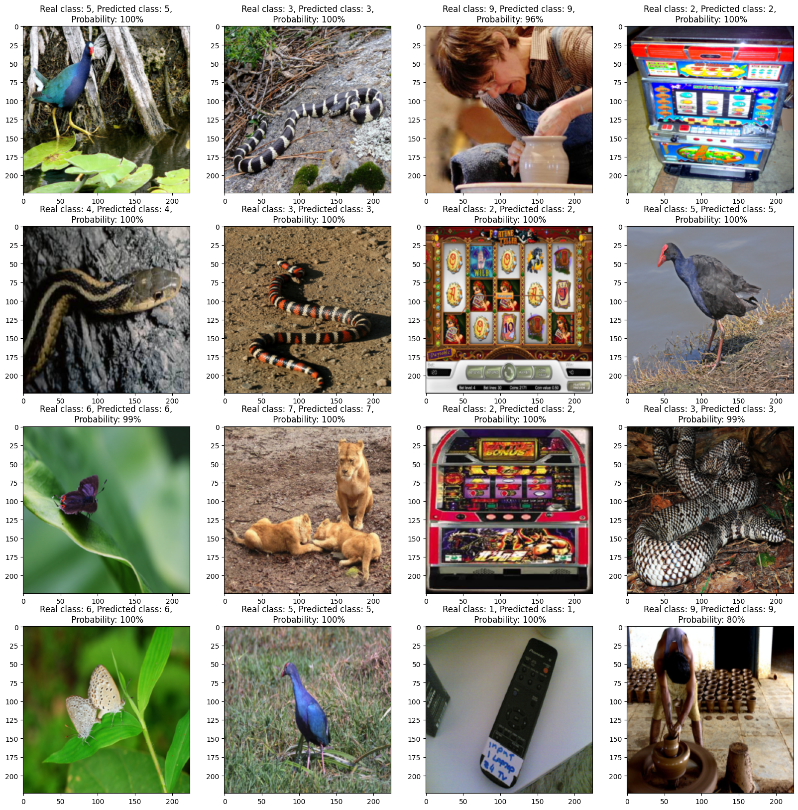

# Classification-ImageNet 

Simple single/multi CPU/GPU example for training classification model on PyTorch.

This project contains: 
  * VGG model architecture and workflow for training on a single GPU for the platforms:
    * Google Colaboratory
    * Yandex DataSphere

  * multi CPU/GPU workflow for the platforms:
    * Yandex DataSphere
## Getting started
1. Download the project or files for preferable platform and case. 

1. Download dataset from [Kaggle](https://www.kaggle.com/competitions/imagenet-object-localization-challenge/data). It is not a classification challenge, but it contains all ImageNet dataset. Instructions how to download dataset(or part of it) you may find [here](https://github.com/Kaggle/kaggle-api).

1. Check all paths to project files or dataset that they are consistent with yours.

## Versions of main used libraries[^1][^2]

| Library | Clabolatory | DataSphere |
| :--- | :---: | :---: |
| python | 3.10.12 | 3.9.16 | 
| kaggle | - | 1.5.13 |
| torch | 2.0.1+cu118 | 1.13.1+cu117[^3] |
| torchvision | 0.15.2+cu118 | 0.14.1 |
| torchsummary | 1.5.1 | 1.5.1 |
| matplotlib | 3.7.1 |  3.3.3 |
| pandas | - | 1.4.4 | 
| sklearn | 1.2.2 | 1.2.2 |
| numpy | 1.22.4 | 1.24.2 |
| pillow | 8.4.0 | 9.5.0 |
| tqdm | 4.65.0 | 4.65.0 |

[^1]: If library version is skipped than it wasn't used for this platform.

[^2]: This list is not include flake8 libraries. This checks was only made to keep code style and not mandatory.

[^3]: For distributive training on GPU and torch 1.9.1+cu111 use backend: "gloo", as "nccl" is not working properly.

## Overview
  Project contains VGG19 and VGG16 architecture with opportunity to choose amount of classes (max ==1000). Also it has simple dataset analysis and filtration gray pictures.
    
  Submitted model weights (ten classes) trained on ImageNet for [VGG19 architecture](#article).

  In addition project contains different flake configurations for [python files](setup.cfg) and [Jupyter Notebooks](tox.ini).

## Results

Validation metrics:
- Accuracy (f1-score 'micro'):  91%. 
- F1-score('macro'): 91%
 
Train took 60 epoch, start learning rate set to 0.01. Optimizer SGD with momentum 0.9 showed better results than Adam. Other training parameters could be found [here](ColabWorkflow/trainVGGModel.ipynb).

**Visualisation on random 16 pictures from validation dataset shows how sure model in the answers**

## Useful links

1. [Very Deep Convolutional Networks for Large-Scale Image Recognition](https://arxiv.org/abs/1409.1556) {#article}
1. [Distributed and parallel training tutorials](https://pytorch.org/tutorials/distributed/home.html)
1. [Single-machine model parallel best practices](https://pytorch.org/tutorials/intermediate/model_parallel_tutorial.html)
1. [Technologies behind Distributed Deep Learning: AllReduce](https://tech.preferred.jp/en/blog/technologies-behind-distributed-deep-learning-allreduce/)
1. [A Comprehensive Tutorial to Pytorch DistributedDataParallel](https://medium.com/codex/a-comprehensive-tutorial-to-pytorch-distributeddataparallel-1f4b42bb1b51)

:lady_beetle: If you found any kind of errors or typos in this project please let me know :vulcan_salute: